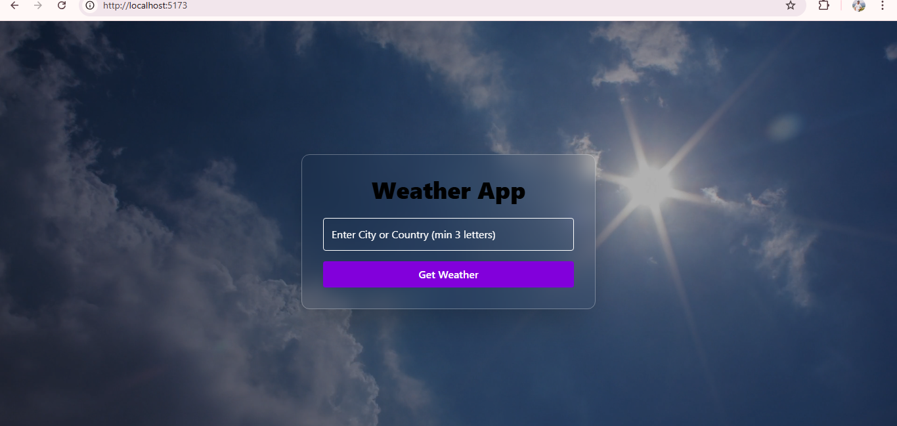
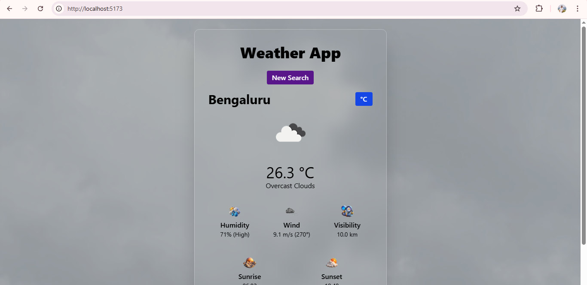

# 🌦️ React Weather App

A sleek and responsive Weather App built with **React.js** and powered by the **OpenWeatherMap API**. Get real-time weather data for any city in the world with sunrise/sunset info, humidity, wind, and more - all beautifully presented in a modern UI. ☁️🌤️🌧️

---

## 📸 Screenshots



---

## ✨ Features

- 🔍 **Search by City or Country** (with smart suggestions)
- 🌡️ **Real-Time Weather Info**
- 🌅 Sunrise & Sunset display
- 💨 Wind direction & speed
- 💧 Humidity levels & visibility
- 🌐 Location-based data via Geo API
- 🎨 Beautiful animated background
- 📱 Fully Responsive on all devices

---

## 🛠️ Tech Stack

| Tech                   | Use                    |
| ---------------------- | ---------------------- |
| **React.js**           | Frontend Framework     |
| **Vite**               | Fast Build Tool        |
| **Tailwind CSS**       | Styling the UI         |
| **OpenWeatherMap API** | Real-time weather data |

---

## 📦 Installation

```bash
# 1. Clone the repo
git clone https://github.com/abhicity/Weather-App.git
cd Weather-App

# 2. Install dependencies
npm install

# 3. Add your API key in .env
echo "VITE_API_KEY=your_openweathermap_key" > .env

# 4. Run the app
npm run dev
```

---

## 🙌 Acknowledgements

[OpenWeatherMap](https://openweathermap.org/api)

[Vercel](https://vercel.com/)

[React](https://react.dev/  )

[Tailwind CSS](https://tailwindcss.com/docs/installation/using-vite)

---

## 📝 License
This project is licensed under the [MIT License]().
You are free to fork, use, and modify it.

---

## 👨‍💻 Author
Made with ❤️ by [Abhishek](https://github.com/abhicity)